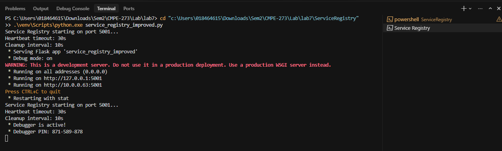
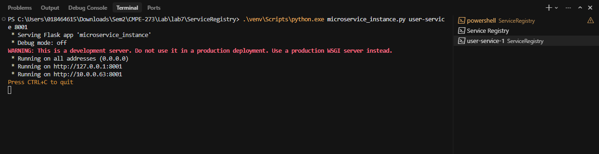
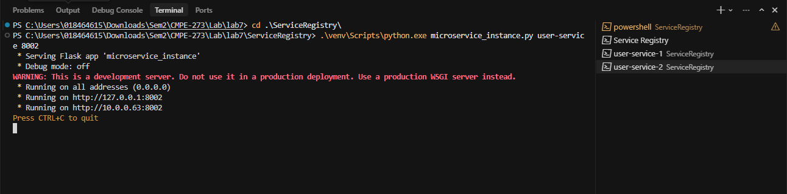
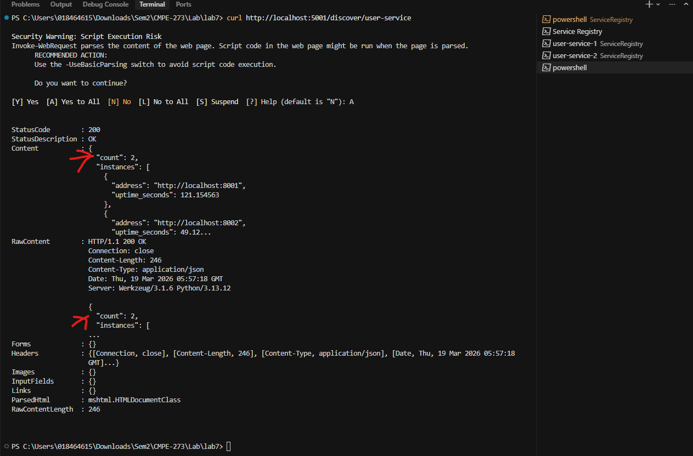
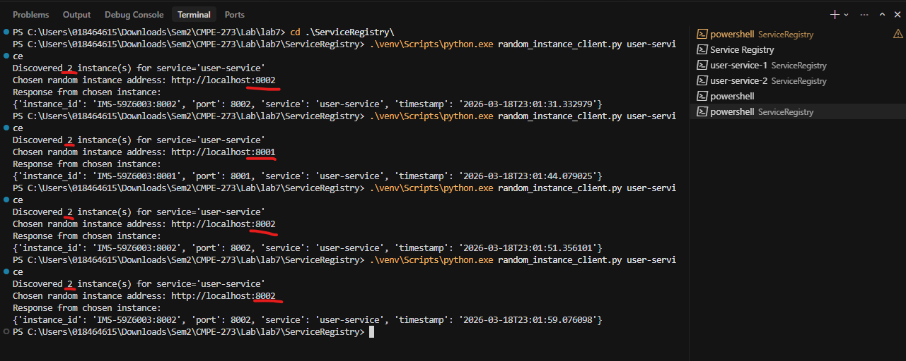
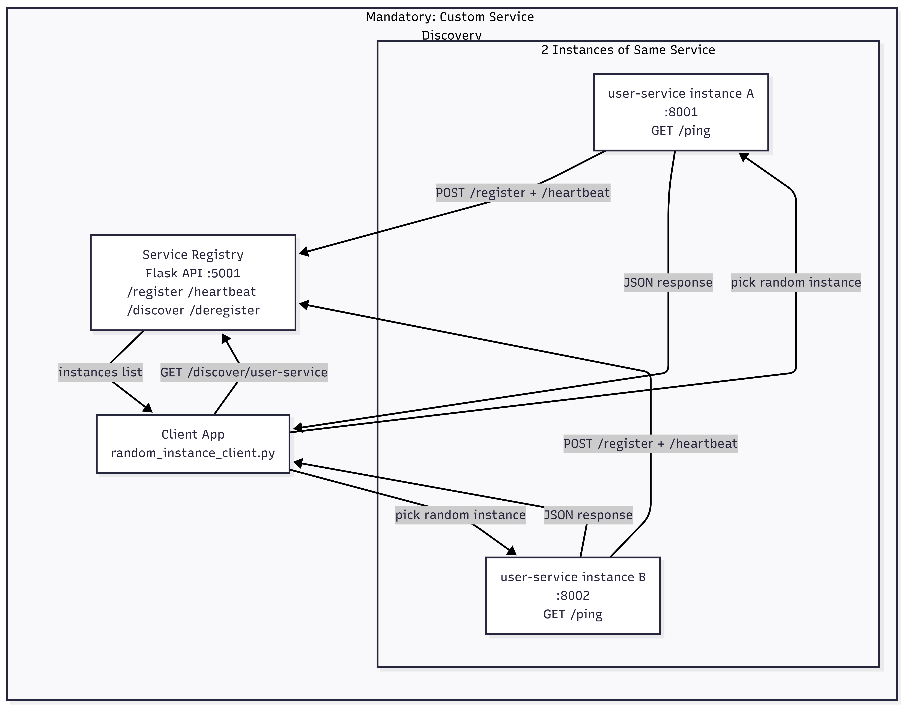

# Demo Screenshots

This file contains screenshots demonstrating the mandatory flow for the Service Registry assignment.

## 1) Service Registry Started

## 2) Service Instance 1 Started

## 3) Service Instance 2 Started

## 4) Verified Service Count (2 Instances)

## 5) Client Discovers and Calls Random Instance

## 6) Architecture Diagram

