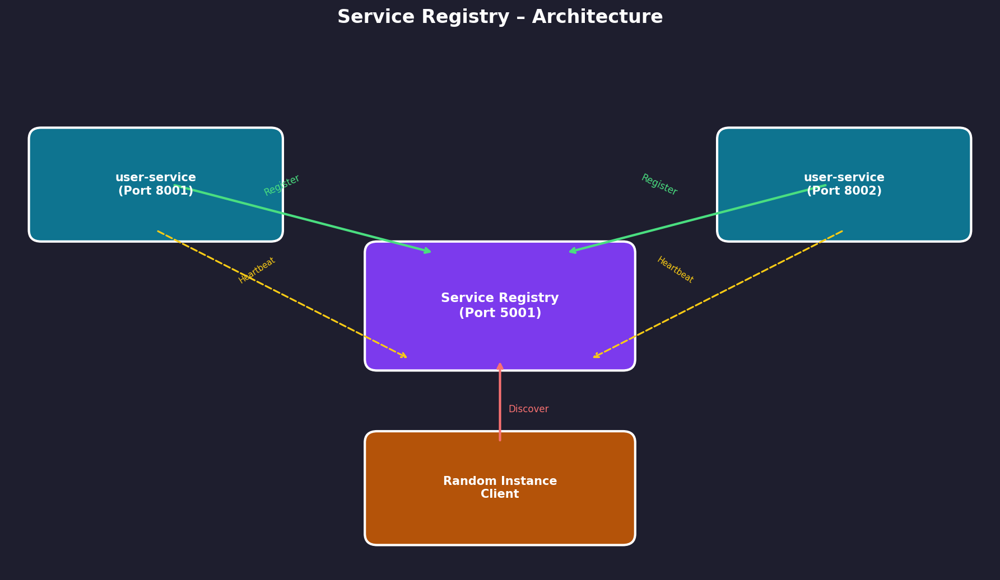
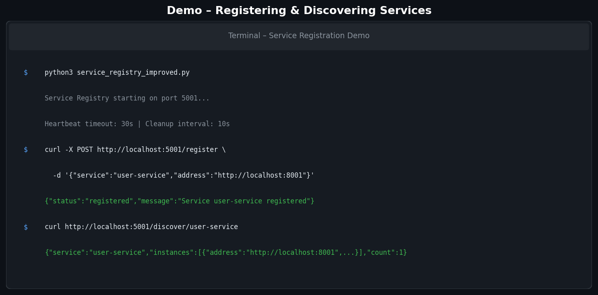
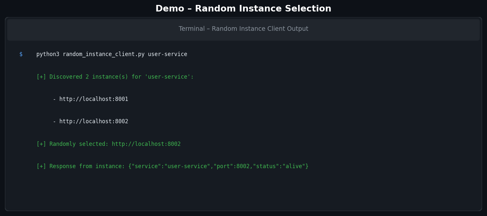
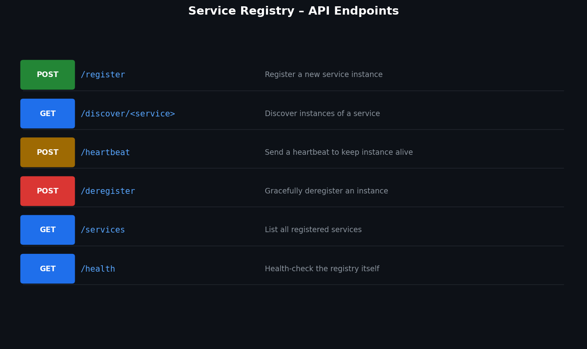

# Demo Proof – Service Registry

This document provides visual proof that the Service Registry implementation works end-to-end, including service registration, discovery, heartbeat monitoring, and random-instance selection.

---

## 1. System Architecture

The diagram below shows how all components interact:



- **Service Registry (Port 5001)** – Central registry that stores every service instance.
- **user-service instances (Ports 8001 & 8002)** – Two identical service instances that register themselves and send periodic heartbeats.
- **Random Instance Client** – Discovers all live instances and calls a randomly selected one.

---

## 2. Service Registration & Discovery Demo

The screenshot below shows the registry starting up, a service being registered via `curl`, and then discovered:



**Steps shown:**
1. Start the improved registry (`python3 service_registry_improved.py`).
2. Register `user-service` at `http://localhost:8001` with a `POST /register` request.
3. Discover the service with `GET /discover/user-service` – returns the instance list with `count: 1`.

---

## 3. Random Instance Client Output

With **two** instances of `user-service` running (ports 8001 and 8002), the random-instance client discovers both and calls one at random:



**Expected behaviour (as shown):**
- `GET /discover/user-service` returns `count: 2`.
- The client prints both discovered addresses.
- The client prints the randomly chosen address (e.g. `http://localhost:8002`).
- The client prints the JSON response from that instance's `/ping` endpoint.

---

## 4. API Endpoints Reference

All endpoints exposed by the Service Registry:



| Method | Endpoint | Purpose |
|--------|----------|---------|
| `POST` | `/register` | Register a new service instance |
| `GET` | `/discover/<service>` | Discover instances of a service |
| `POST` | `/heartbeat` | Send a heartbeat to keep an instance alive |
| `POST` | `/deregister` | Gracefully deregister an instance |
| `GET` | `/services` | List all registered services |
| `GET` | `/health` | Health-check the registry |

---

## 5. How to Reproduce the Demo

### Prerequisites

```bash
python3 -m venv venv
source venv/bin/activate          # Windows: venv\Scripts\activate
pip install -r requirements.txt
```

### Step-by-step

**Terminal 1 – Start the registry:**
```bash
python3 service_registry_improved.py
```

**Terminal 2 – Start service instance #1:**
```bash
python3 microservice_instance.py user-service 8001
```

**Terminal 3 – Start service instance #2:**
```bash
python3 microservice_instance.py user-service 8002
```

**Terminal 4 – Run the random-instance client:**
```bash
python3 random_instance_client.py user-service
```

You should see output matching the screenshot in section 3 above.

---

## 6. How to Add Your Own Screenshots

1. Place your image files (`.png`, `.jpg`, `.gif`, etc.) inside the `images/` folder:
   ```
   images/
   ├── my_screenshot.png
   └── another_image.jpg
   ```
2. Reference them in any Markdown file using a relative path:
   ```markdown
   
   ```
3. For images hosted online, use the full URL:
   ```markdown
   
   ```

> **Tip:** Keep image file names lowercase and use hyphens instead of spaces (e.g. `demo-output.png`) to avoid broken links on case-sensitive file systems.
