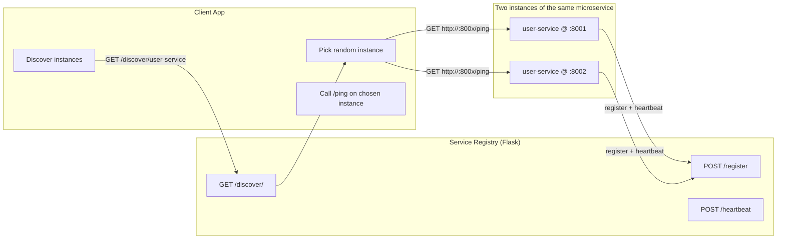
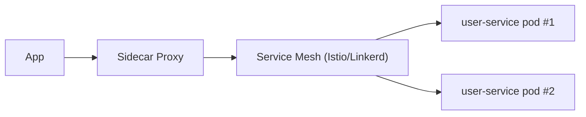

# Assignment Architecture Diagram (Service Discovery + Random Call)

## Mandatory Part (Custom Service Registry)

## Optional Part (Service Mesh Discovery in Kubernetes)

The app can call the Kubernetes `Service` (e.g., `http://user-service:8001/ping`) and the sidecar proxy (Envoy for Istio) does load balancing/routing across pods.

